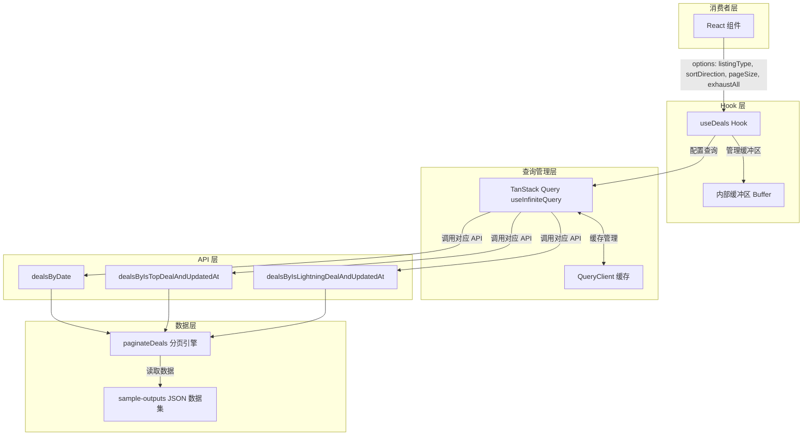
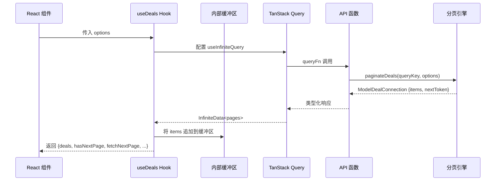
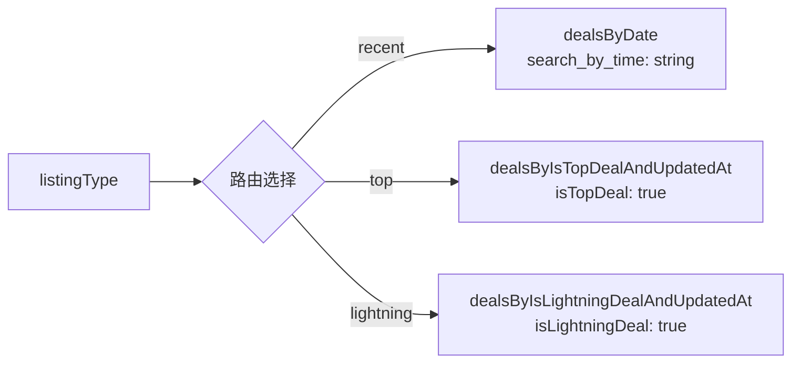
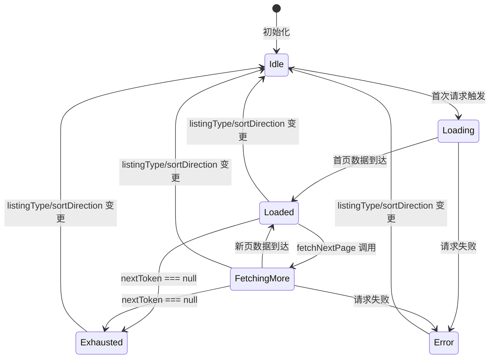
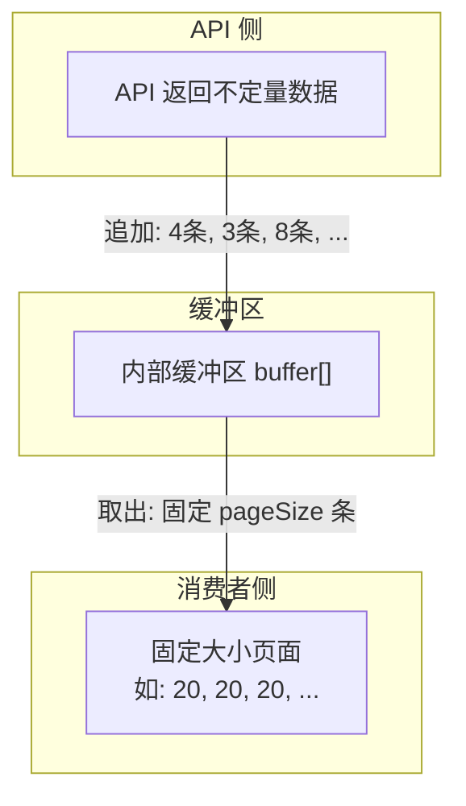
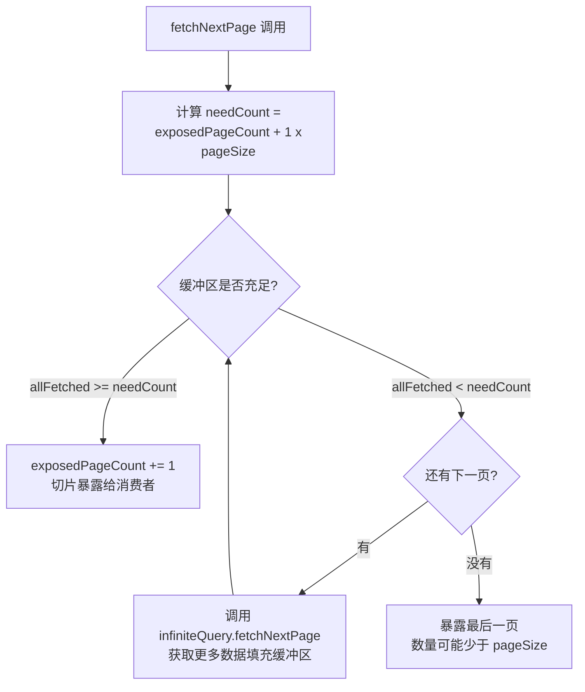
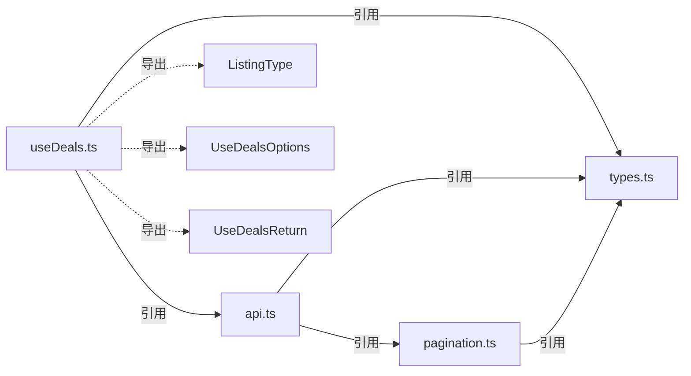

# useDeals Hook 详细设计文档

## 1. 系统架构总览

### 1.1 架构分层



### 1.2 职责边界

| 层级 | 职责 | 不负责 |
|------|------|--------|
| **useDeals Hook** | 查询路由、参数组装、缓冲区管理、一致页面大小、自动完整加载 | 数据排序、分页游标编解码 |
| **TanStack Query** | 缓存管理、请求状态跟踪、自动 refetch、infinite query 分页 | 业务逻辑、缓冲区管理 |
| **API 函数** | 组装请求参数、调用分页引擎、返回类型化响应 | 排序实现、数据存储 |
| **分页引擎** | 数据排序、随机返回数量、nextToken 编解码、数据校验 | 缓存、UI 状态 |

### 1.3 数据流



---

## 2. Hook 接口设计

### 2.1 输入参数类型

```typescript
type ListingType = "recent" | "top" | "lightning";

interface UseDealsOptions {
  /** 交易列表类型，映射到不同的 API 查询函数 */
  listingType: ListingType;

  /** 排序方向，默认 "ASC" */
  sortDirection?: ModelSortDirection;

  /**
   * 消费者期望的固定页面大小。
   * 启用后，Hook 内部缓冲 API 返回的不定量数据，
   * 对外呈现固定大小的分页。
   * 默认值: 20
   */
  pageSize?: number;

  /**
   * 是否自动加载全部数据。
   * 启用后，Hook 会在每次成功获取后自动请求下一页，
   * 直到 nextToken 为 null。
   */
  exhaustAll?: boolean;
}
```

### 2.2 返回值类型

```typescript
interface UseDealsReturn {
  /** 当前已加载且可供消费的交易列表 */
  deals: Deal[];

  /** 初次加载中（无任何数据时） */
  isLoading: boolean;

  /** 正在加载更多数据（已有部分数据） */
  isFetchingMore: boolean;

  /** 是否还有更多数据可加载 */
  hasNextPage: boolean;

  /** 手动触发加载下一页 */
  fetchNextPage: () => void;

  /** 是否已加载完全部数据（exhaustAll 模式下有意义） */
  isExhausted: boolean;

  /** 错误信息 */
  error: Error | null;
}
```

### 2.3 使用示例

```tsx
// 基本用法：加载最近交易，手动翻页
const { deals, hasNextPage, fetchNextPage, isLoading } = useDeals({
  listingType: "recent",
  sortDirection: "DESC",
});

// 完整加载模式：自动加载全部 1000 条
const { deals, isExhausted } = useDeals({
  listingType: "top",
  exhaustAll: true,
});

// 一致页面大小模式：每次 fetchNextPage 给出 20 条
const { deals, fetchNextPage, hasNextPage } = useDeals({
  listingType: "lightning",
  sortDirection: "DESC",
  pageSize: 20,
});
```

---

## 3. 查询路由机制

### 3.1 ListingType 到 API 函数映射

```typescript
const QUERY_CONFIG: Record<ListingType, {
  queryKey: DealQueryKey;
  apiFn: (variables: any) => any;
  fixedVariables: Record<string, string>;
  responseKey: DealQueryKey;
}> = {
  recent: {
    queryKey: "dealsByDate",
    apiFn: dealsByDate,
    fixedVariables: { search_by_time: "2026-07-06" },
    responseKey: "dealsByDate",
  },
  top: {
    queryKey: "dealsByIsTopDealAndUpdatedAt",
    apiFn: dealsByIsTopDealAndUpdatedAt,
    fixedVariables: { isTopDeal: "true" },
    responseKey: "dealsByIsTopDealAndUpdatedAt",
  },
  lightning: {
    queryKey: "dealsByIsLightningDealAndUpdatedAt",
    apiFn: dealsByIsLightningDealAndUpdatedAt,
    fixedVariables: { isLightningDeal: "true" },
    responseKey: "dealsByIsLightningDealAndUpdatedAt",
  },
};
```

### 3.2 查询路由流程



### 3.3 排序字段映射

各查询类型在服务端使用不同的排序字段（由分页引擎内部决定），Hook 不需要关心排序字段，仅需传递 `sortDirection`：

| ListingType | DealQueryKey | 服务端排序字段 |
|-------------|-------------|---------------|
| `recent` | `dealsByDate` | `createdAt` |
| `top` | `dealsByIsTopDealAndUpdatedAt` | `updatedAt` |
| `lightning` | `dealsByIsLightningDealAndUpdatedAt` | `updatedAt` |

---

## 4. 状态管理与重置逻辑

### 4.1 TanStack Query queryKey 设计

```typescript
const queryKey = ["deals", listingType, sortDirection] as const;
```

当 `listingType` 或 `sortDirection` 发生变化时，`queryKey` 也随之变化。TanStack Query 会自动将旧 queryKey 的缓存标记为 stale，并为新 queryKey 发起全新请求。这确保了：
- 旧数据被自动丢弃（不会展示给消费者）
- 新请求从 `nextToken = undefined`（即第一页）开始
- 不会出现跨 queryKey/sortDirection 复用旧 nextToken 导致分页引擎抛异常的情况

### 4.2 内部缓冲区重置

当 `queryKey` 变化时，Hook 内部维护的缓冲区（用于一致页面大小模式）也必须同步清空。实现方式：

```typescript
const prevKeyRef = useRef(queryKey);

useEffect(() => {
  if (!shallowEqual(prevKeyRef.current, queryKey)) {
    bufferRef.current = [];
    exposedPageCountRef.current = 0;
    prevKeyRef.current = queryKey;
  }
}, [queryKey]);
```

### 4.3 状态机



---

## 5. 分页策略

### 5.1 基本分页

使用 TanStack Query 的 `useInfiniteQuery`，核心配置：

```typescript
const infiniteQuery = useInfiniteQuery({
  queryKey: ["deals", listingType, sortDirection],

  queryFn: ({ pageParam }) => {
    const config = QUERY_CONFIG[listingType];
    const variables = {
      ...config.fixedVariables,
      limit: pageSize,
      nextToken: pageParam ?? undefined,
      sortDirection,
    };
    const response = config.apiFn(variables);
    return response.data[config.responseKey] as ModelDealConnection;
  },

  initialPageParam: null as string | null,

  getNextPageParam: (lastPage) => lastPage.nextToken,
});
```

消费者调用 `fetchNextPage()` 即可加载下一页，TanStack Query 会自动管理 `nextToken` 的传递。

### 5.2 完整加载模式（Stretch A）

当 `exhaustAll = true` 时，Hook 在每次成功获取一页数据后自动触发下一页请求：

```typescript
useEffect(() => {
  if (exhaustAll && infiniteQuery.hasNextPage && !infiniteQuery.isFetchingNextPage) {
    infiniteQuery.fetchNextPage();
  }
}, [exhaustAll, infiniteQuery.hasNextPage, infiniteQuery.isFetchingNextPage, infiniteQuery.data]);
```

终止条件：`getNextPageParam` 返回 `undefined`（即 `nextToken === null` 时不返回值），TanStack Query 会自动将 `hasNextPage` 设为 `false`。

**约束保证：**
- 总计返回 1,000 条 deals（每个数据集的固定大小）
- 所有 `id` 唯一（分页引擎保证不重复）
- 排序顺序正确（分页引擎在分页前已排序）

### 5.3 一致页面大小模式（Stretch B）

#### 5.3.1 问题背景

模拟 API 的 `limit` 参数是最大值而非精确值。调用 `limit: 20` 可能返回 1~20 条数据。直接暴露给消费者会导致页面大小不一致（如 `[14, 2, 8, ...]`）。

#### 5.3.2 解决方案：内部缓冲区



#### 5.3.3 缓冲区工作原理

Hook 维护以下内部状态：

```typescript
// TanStack Query 拿到的所有原始数据（平铺）
const allFetchedDeals: Deal[] = infiniteQuery.data?.pages.flatMap(p => p.items) ?? [];

// 已经暴露给消费者的页数
const [exposedPageCount, setExposedPageCount] = useState(0);

// 消费者可见的 deals = 前 (exposedPageCount * pageSize) 条
const deals = allFetchedDeals.slice(0, exposedPageCount * pageSize);
```

#### 5.3.4 fetchNextPage 逻辑

消费者调用 `fetchNextPage()` 时：

1. 计算下一页需要的 deals 数量：`needCount = (exposedPageCount + 1) * pageSize`
2. 如果 `allFetchedDeals.length >= needCount`：
   - 直接从缓冲区切片，`exposedPageCount += 1`
3. 如果 `allFetchedDeals.length < needCount` 且 `hasNextPage`：
   - 持续调用 API 获取更多数据直到缓冲区充足
   - 缓冲区满足后再暴露给消费者
4. 如果 `allFetchedDeals.length < needCount` 且 `!hasNextPage`：
   - 这是最后一页，不足 pageSize 也可以暴露



#### 5.3.5 一致性保证

| 保证项 | 实现方式 |
|--------|---------|
| 每页固定大小 | 缓冲区充足后才暴露，切片长度固定为 `pageSize` |
| 最后一页可短 | 当 API 无更多数据时，允许不足 `pageSize` 的最后页 |
| 无重复 | TanStack Query 的 pages 数组有序追加，分页引擎保证无重复 |
| 无跳过 | 按顺序从缓冲区切片，不跳过任何 deal |
| 顺序正确 | 分页引擎在排序后再分页，Hook 按 pages 顺序平铺 |

---

## 6. 错误处理

### 6.1 API 层异常

分页引擎在以下情况会抛出异常：

| 异常条件 | 错误信息 | Hook 预防措施 |
|---------|---------|-------------|
| `nextToken` 的 queryKey 与当前查询不匹配 | `"nextToken does not match query"` | 切换 listingType 时通过 queryKey 变化自动重置 |
| `nextToken` 的 sortDirection 与当前不匹配 | `"nextToken does not match sortDirection"` | 切换 sortDirection 时通过 queryKey 变化自动重置 |
| `limit <= 0` | `"limit must be greater than 0"` | pageSize 默认 20，类型约束防止非法值 |
| `nextToken` 的 offset 超出范围 | `"nextToken offset is out of range"` | 正常流程不会触发 |

### 6.2 TanStack Query 错误处理

TanStack Query 内置重试机制（默认重试 3 次），Hook 通过返回值的 `error` 字段将异常传递给消费者：

```typescript
const error = infiniteQuery.error ?? null;
```

### 6.3 参数变更竞态

当用户快速切换 `listingType` 或 `sortDirection` 时，TanStack Query 会自动取消正在进行的旧请求（通过 AbortSignal），并为新 queryKey 发起请求，不会产生竞态条件。

---

## 7. 边界情况

### 7.1 空结果集

虽然当前每个数据集包含 1,000 条数据，但 Hook 设计应处理空数据集：
- 首次请求返回 `items: []` + `nextToken: null`
- `deals` 返回空数组，`hasNextPage` 为 `false`，`isExhausted` 为 `true`

### 7.2 最后一页不足 pageSize

一致页面大小模式下：
- 1,000 条数据按 pageSize=20 分页，恰好 50 页，每页 20 条
- 如果 pageSize 不能整除总数（如 pageSize=30），最后一页只有 `1000 % 30 = 10` 条
- Hook 在 API 无更多数据时，将剩余数据作为最后一页暴露

### 7.3 连续快速切换参数

- TanStack Query 的 queryKey 机制天然处理此场景
- 每次 queryKey 变化，旧查询停止，新查询启动
- 缓冲区同步清空，消费者看到的 deals 立即变为空数组或新数据

### 7.4 exhaustAll 模式下的性能

- 1,000 条数据在 API 返回量随机（1~20）的情况下，平均需要约 95 次 API 调用
- 所有调用是同步的（模拟 API 读本地文件），不存在网络延迟
- 但在真实场景中需要考虑请求频率限制和内存占用

---

## 8. 类型系统设计

### 8.1 完整类型定义

```typescript
import type { Deal, ModelSortDirection, ModelDealConnection, DealQueryKey } from "./types";

export type ListingType = "recent" | "top" | "lightning";

export interface UseDealsOptions {
  listingType: ListingType;
  sortDirection?: ModelSortDirection;
  pageSize?: number;
  exhaustAll?: boolean;
}

export interface UseDealsReturn {
  deals: Deal[];
  isLoading: boolean;
  isFetchingMore: boolean;
  hasNextPage: boolean;
  fetchNextPage: () => void;
  isExhausted: boolean;
  error: Error | null;
}

export interface QueryConfig {
  queryKey: DealQueryKey;
  apiFn: (variables: any) => { data: Record<string, ModelDealConnection> };
  fixedVariables: Record<string, string>;
  responseKey: DealQueryKey;
}
```

### 8.2 类型依赖关系



---

## 9. 文件规模约束（300 行限制）

### 9.1 约束规则

| 规则 | 说明 |
|------|------|
| 单文件上限 | 300 行（不含空行和纯注释行） |
| 豁免文件 | CSS/样式文件、测试文件（`*.test.ts`） |
| 适用范围 | `src/` 下所有 `.ts` / `.tsx` 业务代码文件 |

### 9.2 各文件行数估算

| 文件 | 职责 | 预估行数 | 是否达标 |
|------|------|---------|---------|
| `src/useDeals.ts` | Hook 主体：类型定义 + 查询路由 + useInfiniteQuery + 缓冲区 + exhaustAll | ~180 行 | ✅ |
| `src/types.ts` | 已提供，只读 | 124 行 | ✅ |
| `src/api.ts` | 已提供，只读 | 55 行 | ✅ |
| `src/pagination.ts` | 已提供，只读 | 174 行 | ✅ |
| `src/useDeals.test.ts` | 测试文件 | ~300+ 行 | 豁免 |

由于 `useDeals.ts` 预估 ~180 行，远低于 300 行上限，**无需拆分文件**。查询路由配置（`QUERY_CONFIG`）、类型定义、Hook 主体可全部放在同一文件中，符合 README 的预期结构。

### 9.3 如果 Hook 超出 300 行的拆分策略

若后续功能扩展导致超限，可按以下方案拆分：

```
src/
├── useDeals.ts          # Hook 主体（~120 行）
├── useDeals.config.ts   # QUERY_CONFIG + 类型导出（~60 行）
└── useDeals.test.ts     # 测试（豁免）
```

拆分原则：**分页归一化和缓冲逻辑必须保留在 `useDeals.ts` 中**（README 要求："All pagination normalization and buffering logic belongs in `useDeals`"）。

---

## 10. 数据库设计（第三范式）

> 注：README 需求文档聚焦于前端 Hook 实现，不涉及后端数据库。本节为补充设计，描述 `Deal` 实体在关系型数据库中的 3NF 存储方案，供后端参考。

### 10.1 原始数据结构分析

`types.ts` 中的 `Deal` 接口是扁平化的宽表结构，存在以下 3NF 违规：

| 违规类型 | 具体字段 | 说明 |
|---------|---------|------|
| **传递依赖** | `poster_name`, `poster_img_url` → `poster_id` | 发布者信息依赖于 `poster_id`，而非直接依赖主键 `id` |
| **冗余派生** | `title_lowercase` ← `title` | 小写版本可由应用层或数据库生成列计算 |
| **冗余派生** | `description_lowercase` ← `description` | 同上 |
| **冗余派生** | `forum_type_lowercase` ← `forum_type` | 同上 |
| **冗余派生** | `sub_category_lowercase` ← `sub_category` | 同上 |
| **冗余派生** | `dealer_type_lowercase` ← `dealer_type` | 同上 |
| **多值属性** | `available_states[]` | 一对多关系应拆为独立表 |
| **多值属性** | `available_store_addresses[]`, `available_store_zipcodes[]`, `available_store_geohashes[]` | 门店位置的多值属性 |
| **多值属性** | `uploaded_img_links[]` | 图片链接列表 |
| **多值属性** | `additionalTitles[]`, `additionalLinks[]` | 附加信息列表 |

### 10.2 3NF 表结构设计

#### 表 1：`deals`（主表）

```sql
CREATE TABLE deals (
    id              VARCHAR(36) PRIMARY KEY,
    short_code      VARCHAR(50) NOT NULL,
    store_sku       VARCHAR(100),
    title           VARCHAR(500) NOT NULL,
    description     TEXT,
    price           DECIMAL(10,2) NOT NULL,
    prev_price      DECIMAL(10,2),
    price_drop      DECIMAL(10,2),
    deal_link       VARCHAR(2048),
    affiliate_link  VARCHAR(2048),
    img_link        VARCHAR(2048),
    deal_type       VARCHAR(50),
    deal_day_type   VARCHAR(50),
    is_top_deal     BOOLEAN DEFAULT FALSE,
    is_trending_deal BOOLEAN DEFAULT FALSE,
    is_lightning_deal BOOLEAN DEFAULT FALSE,
    instore         BOOLEAN DEFAULT FALSE,
    specific_states BOOLEAN DEFAULT FALSE,
    specific_stores BOOLEAN DEFAULT FALSE,
    free_shipping   BOOLEAN DEFAULT FALSE,
    free_pickup     BOOLEAN DEFAULT FALSE,
    vote            INT DEFAULT 0,
    down_vote       INT DEFAULT 0,
    highest_votes   INT DEFAULT 0,
    highest_ratio   DECIMAL(5,4) DEFAULT 0,
    expired         BOOLEAN DEFAULT FALSE,
    expired_status  VARCHAR(50),
    expired_ttl     INT,
    expired_voted_number            INT DEFAULT 0,
    expired_voted_number_accumulated INT DEFAULT 0,
    reported_number                 INT DEFAULT 0,
    reported_number_accumulated     INT DEFAULT 0,
    expiration_date TIMESTAMP,
    posted_date     TIMESTAMP,
    search_by_time  VARCHAR(50),
    search_by_vote  VARCHAR(50),
    owner           VARCHAR(100),
    poster_id       VARCHAR(36) NOT NULL,
    forum_type      VARCHAR(100),
    sub_category    VARCHAR(100),
    dealer_type     VARCHAR(100),
    _version        INT DEFAULT 1,
    _deleted        BOOLEAN DEFAULT FALSE,
    _last_changed_at BIGINT,
    created_at      TIMESTAMP DEFAULT CURRENT_TIMESTAMP,
    updated_at      TIMESTAMP DEFAULT CURRENT_TIMESTAMP,

    FOREIGN KEY (poster_id) REFERENCES posters(id)
);
```

#### 表 2：`posters`（发布者表）

消除 `poster_name`, `poster_img_url` 对 `poster_id` 的传递依赖：

```sql
CREATE TABLE posters (
    id          VARCHAR(36) PRIMARY KEY,
    name        VARCHAR(200) NOT NULL,
    img_url     VARCHAR(2048)
);
```

#### 表 3：`deal_promotions`（促销信息表）

将 `promotional_code`, `coupon`, `amazon_subscribe_save` 统一为促销条目：

```sql
CREATE TABLE deal_promotions (
    id          BIGINT AUTO_INCREMENT PRIMARY KEY,
    deal_id     VARCHAR(36) NOT NULL,
    promo_type  ENUM('promotional_code', 'coupon', 'amazon_subscribe_save') NOT NULL,
    code        VARCHAR(200),

    FOREIGN KEY (deal_id) REFERENCES deals(id) ON DELETE CASCADE,
    UNIQUE (deal_id, promo_type)
);
```

#### 表 4：`deal_available_states`（适用州表）

拆解 `available_states[]` 多值属性：

```sql
CREATE TABLE deal_available_states (
    deal_id     VARCHAR(36) NOT NULL,
    state       VARCHAR(50) NOT NULL,

    PRIMARY KEY (deal_id, state),
    FOREIGN KEY (deal_id) REFERENCES deals(id) ON DELETE CASCADE
);
```

#### 表 5：`deal_store_locations`（门店位置表）

拆解门店相关多值属性，每行代表一个门店位置：

```sql
CREATE TABLE deal_store_locations (
    id          BIGINT AUTO_INCREMENT PRIMARY KEY,
    deal_id     VARCHAR(36) NOT NULL,
    address     VARCHAR(500),
    zipcode     VARCHAR(20),
    geohash     VARCHAR(20),
    place_id    VARCHAR(100),

    FOREIGN KEY (deal_id) REFERENCES deals(id) ON DELETE CASCADE
);
```

#### 表 6：`deal_images`（图片表）

拆解 `uploaded_img_links[]` 多值属性：

```sql
CREATE TABLE deal_images (
    id          BIGINT AUTO_INCREMENT PRIMARY KEY,
    deal_id     VARCHAR(36) NOT NULL,
    img_url     VARCHAR(2048) NOT NULL,
    sort_order  INT DEFAULT 0,

    FOREIGN KEY (deal_id) REFERENCES deals(id) ON DELETE CASCADE
);
```

#### 表 7：`deal_additional_info`（附加信息表）

拆解 `additionalTitles[]` 和 `additionalLinks[]`：

```sql
CREATE TABLE deal_additional_info (
    id          BIGINT AUTO_INCREMENT PRIMARY KEY,
    deal_id     VARCHAR(36) NOT NULL,
    info_type   ENUM('title', 'link') NOT NULL,
    value       VARCHAR(2048) NOT NULL,
    sort_order  INT DEFAULT 0,

    FOREIGN KEY (deal_id) REFERENCES deals(id) ON DELETE CASCADE
);
```

### 10.3 ER 关系图

```mermaid
erDiagram
    posters ||--o{ deals : "发布"
    deals ||--o{ deal_promotions : "拥有促销"
    deals ||--o{ deal_available_states : "适用州"
    deals ||--o{ deal_store_locations : "门店位置"
    deals ||--o{ deal_images : "商品图片"
    deals ||--o{ deal_additional_info : "附加信息"

    posters {
        VARCHAR id PK
        VARCHAR name
        VARCHAR img_url
    }

    deals {
        VARCHAR id PK
        VARCHAR title
        DECIMAL price
        DECIMAL prev_price
        BOOLEAN is_top_deal
        BOOLEAN is_lightning_deal
        VARCHAR poster_id FK
        VARCHAR forum_type
        VARCHAR sub_category
        VARCHAR dealer_type
        TIMESTAMP created_at
        TIMESTAMP updated_at
    }

    deal_promotions {
        BIGINT id PK
        VARCHAR deal_id FK
        ENUM promo_type
        VARCHAR code
    }

    deal_available_states {
        VARCHAR deal_id PK_FK
        VARCHAR state PK
    }

    deal_store_locations {
        BIGINT id PK
        VARCHAR deal_id FK
        VARCHAR address
        VARCHAR zipcode
        VARCHAR geohash
    }

    deal_images {
        BIGINT id PK
        VARCHAR deal_id FK
        VARCHAR img_url
        INT sort_order
    }

    deal_additional_info {
        BIGINT id PK
        VARCHAR deal_id FK
        ENUM info_type
        VARCHAR value
    }
```

### 10.4 允许的冗余及理由

| 冗余字段 | 保留位置 | 理由 |
|---------|---------|------|
| `forum_type` | `deals` 表直接存储，未单独建表 | 分类值有限且稳定，建表反而增加 JOIN 开销；可用 CHECK 约束保证一致性 |
| `sub_category` | `deals` 表直接存储 | 同上 |
| `dealer_type` | `deals` 表直接存储 | 同上 |
| `*_lowercase` 字段 | **已去除** | 改用数据库生成列 `GENERATED ALWAYS AS (LOWER(column))` 或应用层处理 |

### 10.5 3NF 验证

| 范式 | 验证 | 结果 |
|------|------|------|
| **1NF** | 所有属性为原子值，多值属性已拆为独立表 | ✅ |
| **2NF** | 所有非主键属性完全依赖于主键（无部分依赖） | ✅ |
| **3NF** | 消除传递依赖：`poster_name`/`poster_img_url` 移至 `posters` 表，促销信息移至 `deal_promotions` | ✅ |
